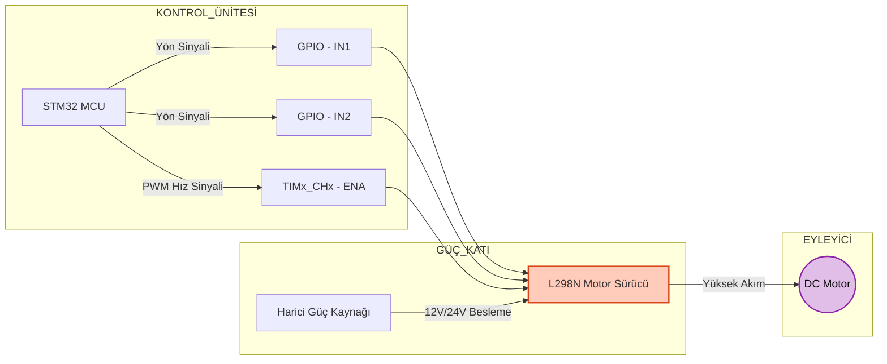
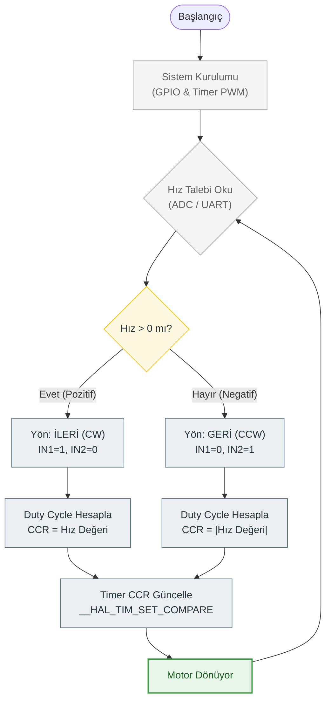

# STM32 ile DC Motor Hız ve Yön Kontrol Sistemi
# (DC Motor Speed & Direction Control using STM32 PWM)


## 📖 Proje Özeti (Abstract)

Bu proje, **Gömülü Sistemler ve Motor Sürücü** uygulamaları kapsamında **Kemal Can Güngör** tarafından geliştirilmiştir.

Proje, fırçalı bir DC motorun (Brushed DC Motor) hızını ve dönüş yönünü **STM32** mikrodenetleyicisi kullanarak hassas bir şekilde kontrol etmeyi amaçlar. Hız kontrolü için **Timer (TIM)** birimleri üzerinden üretilen **PWM (Pulse Width Modulation)** sinyalleri kullanılırken, yön kontrolü H-Köprüsü (H-Bridge) topolojisine sahip bir sürücü entegresi (L298N veya L293D) üzerinden GPIO pinleri ile sağlanır.

Sistem, endüstriyel robotik kollar, otonom araçlar (RC Car) ve fan kontrol sistemleri için temel bir altyapı sunar.

---

## ✨ Temel Özellikler (Key Features)

* **Hassas Hız Kontrolü:** Timer çevre birimi ile %0-%100 arasında ayarlanabilir PWM Duty Cycle (Görev Döngüsü).
* **Çift Yönlü Hareket:** H-Köprüsü sürücüsü sayesinde Saat Yönü (CW) ve Saat Yönünün Tersi (CCW) dönüş yeteneği.
* **Yumuşak Başlangıç (Soft Start):** Ani akım çekimlerini (Inrush Current) engellemek için kademeli hızlanma algoritması.
* **Donanım Koruması:** Sürücü entegresi ile mikrodenetleyici arasında optik veya diyot tabanlı geri besleme koruması (Back-EMF Protection).
* **Modüler Yapı:** Farklı motor sürücüler (L298N, TB6612FNG) ile uyumlu esnek kod mimarisi.

---

## 🛠️ Sistem Mimarisi (System Architecture)

Sistem, kontrol sinyallerini üreten dijital katman ve yüksek akımı yöneten güç katmanından oluşur.

### 1. Donanım Bileşenleri (Hardware Stack)
| Bileşen | Teknik Detay | Görevi |
| :--- | :--- | :--- |
| **Mikrodenetleyici** | STM32 Serisi (F103/F407) | PWM sinyal üretimi ve lojik kontrol. |
| **Motor Sürücü** | L298N / L293D Modülü | Düşük güçlü PWM sinyalini yüksek akımlı motor sürüşüne çevirir. |
| **Eyleyici** | 12V/24V DC Motor | Kontrol edilen mekanik yük. |
| **Güç Kaynağı** | Harici Batarya / Adaptör | Motorlar için izole güç sağlar. |

#### Donanım Bağlantı Şeması (Wiring Diagram)
Aşağıdaki şema, STM32 ile Motor Sürücü arasındaki sinyal akışını göstermektedir:



### 2. Yazılım Teknolojileri (Software Stack)
* **Dil:** Embedded C
* **Sürücüler:** STM32 HAL (Hardware Abstraction Layer)
* **Periferik:** TIM (Timer) PWM Generation, GPIO Output
* **IDE:** STM32CubeIDE

---

## 🔄 Algoritma Akış Şeması (Methodology & Workflow)

Yazılım, kullanıcıdan gelen hız talebini işleyerek uygun PWM sinyalini üretir.

**(Kontrol Algoritması)**



---

## 💻 Kod Örneği (Code Snippet)

Motor hızını ayarlamak için kullanılan temel HAL fonksiyonu:

```c
// Motor Yönünü Ayarla (İleri)
HAL_GPIO_WritePin(GPIOA, IN1_PIN, GPIO_PIN_SET);
HAL_GPIO_WritePin(GPIOA, IN2_PIN, GPIO_PIN_RESET);

// PWM Sinyalini Başlat ve Hızı Ayarla (0-1000 arası)
HAL_TIM_PWM_Start(&htim2, TIM_CHANNEL_1);
__HAL_TIM_SET_COMPARE(&htim2, TIM_CHANNEL_1, 500); // %50 Hız
```

---

## 💻 Kurulum ve Kullanım (Build & Flash)

Projeyi çalıştırmak için:

1.  **Depoyu Klonlayın:**
    ```bash
    git clone [https://github.com/KemalCaan/KemalCaan-How-to-control-a-dc-motor.git](https://github.com/KemalCaan/KemalCaan-How-to-control-a-dc-motor.git)
    ```

2.  **STM32CubeIDE ile Açın:**
    * `.ioc` dosyasını açarak Timer ayarlarını (Prescaler/Period) motorunuza göre düzenleyin.
    
3.  **Derleme ve Yükleme:**
    * Kodları derleyin ve ST-Link ile yükleyin.
    * PWM pinini sürücünün `ENA` veya `ENB` pinine bağlamayı unutmayın.

---

## 👨‍💻 Geliştirici (Developer)

**Kemal Can Güngör**
* **Unvan:** Elektrik-Elektronik Mühendisi
* **Uzmanlık:** Gömülü Yazılım, Motor Kontrol, Güç Elektroniği
* **İletişim:** [LinkedIn Profilim](https://www.linkedin.com/in/kemal-can-g%C3%BCng%C3%B6r-4598b4234/)

---

## 📄 Lisans

Bu proje **MIT Lisansı** altında açık kaynak olarak sunulmuştur.
